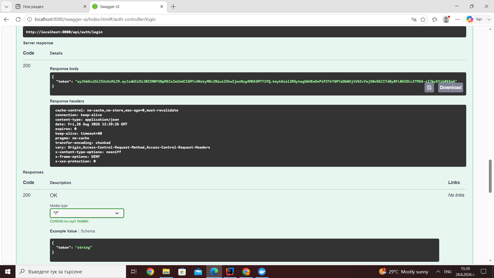
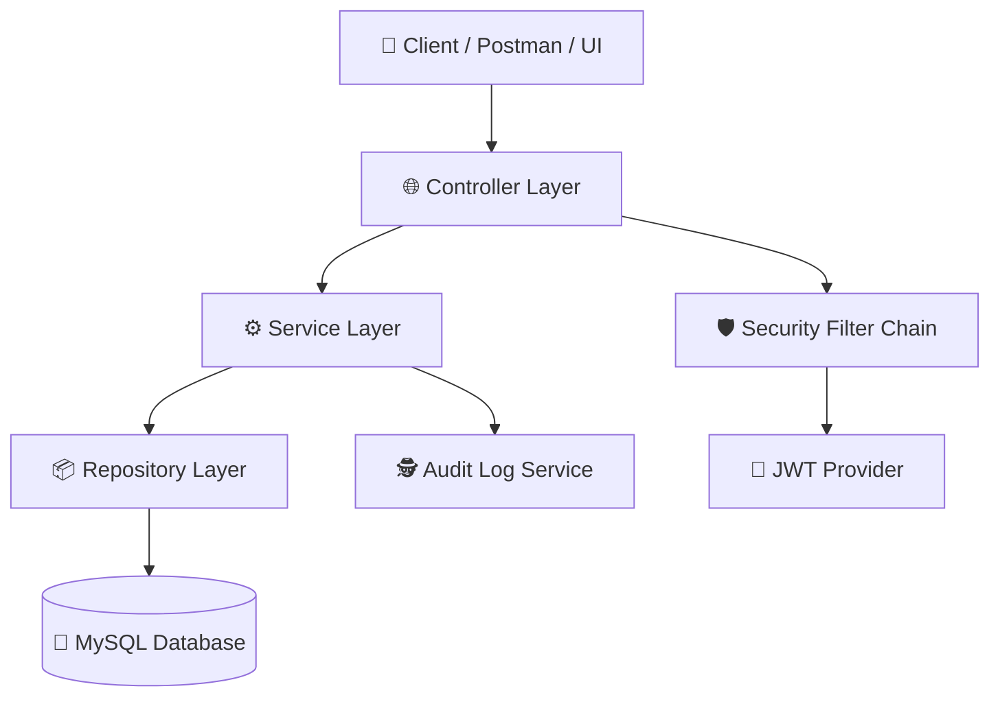
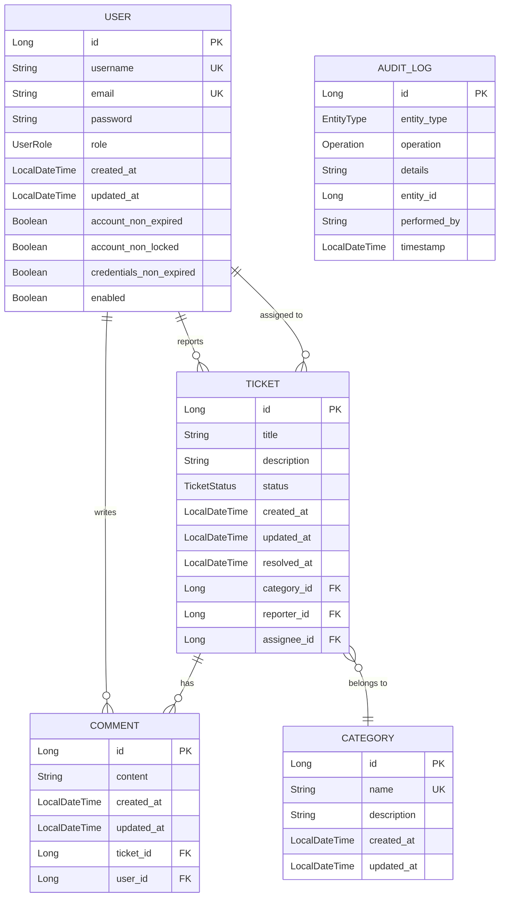

# 🎫 IT Ticket System


A Spring Boot REST API for managing internal IT support tickets. It handles the full issue lifecycle—allowing employees to report problems, assigning tickets to technicians, and enforcing role-based permissions across the system.

---

## 🛠️ Tech Stack

- **Core Runtime:** ☕ Java 21 (LTS)
- **Framework:** 🍃 Spring Boot 3.5.14
- **Security:** 🔒 Spring Security (Method-level authorization, BCrypt)
- **Authentication:** 🔑 JWT (`jjwt` 0.12.3)
- **Database & ORM:** 🐬 MySQL 8.0, Spring Data JPA, Hibernate
- **API Engine & Specs:** 🌐 RESTful APIs, 📖 SpringDoc OpenAPI 2.7.0 (Swagger UI)
- **Containerization & Build:** 🐳 Docker, Docker Compose, Maven
- **Utilities:** 🧱 Lombok, Jakarta Validation

---

## ✨ Key Features

* 🔐 **Role-Based Access Control (RBAC):** Fine-grained permission model for `EMPLOYEE`, `TECHNICIAN`, and `ADMIN` roles.
* 🔑 **Stateless JWT Security:** Full authentication lifecycle featuring login and user registration endpoints.
* 🔄 **Complete Ticket Lifecycle:** End-to-end workflow management (`NEW` ➡️ `ASSIGNED` ➡️ `IN_PROGRESS` ➡️ `RESOLVED` ➡️ `CLOSED`).
* 🕵️ **Entity Audit Logging:** Automated audit trail system recording all system-wide data updates *(Admin access)*.
* 💬 **Collaborative Threading:** Commenting mechanism attached to tickets for seamless technician-user communication.
* 📂 **Category & User Control:** Centralized administrator panels for ticket categorizations and user management.
* ✅ **Validation & Error Handling:** Global exception handling interceptors paired with Jakarta bean validation.
* 📑 **Interactive OpenAPI Docs:** Embedded Swagger interface for rapid endpoint testing and contract verification.
* 🔀 **Multi-Param Sorting:** Dynamic sorting engine by ID, status, priority, and timestamp fields.

---

## 📸 API Preview


*JWT Authentication flow returning a 200 OK token response via Swagger UI.*

---

## 🏗️ Architecture Design


## 🗄️ Database Schema


    
## Prerequisites

- ☕ **Java 21** or higher
- 📦 **Maven 3.8+** - Build tool
- 🐳 **Docker** and **Docker Compose** - For MySQL database container
- 🐬 **MySQL 8.0** - Database
- 💻 IDE(IntelliJ IDEA, Eclipse, VS Code, etc.)
- 🔀 **Git** (optional) - For cloning the repository

## Installation & Setup

### 1. Clone the Repository

```bash
git clone https://github.com/nakovivan05/it-ticket-system.git
cd it-ticket-system
```

### 2. Open the Folder in IDE

Open the project folder in your preferred IDE (IntelliJ IDEA, Eclipse, VS Code, etc.):

IntelliJ IDEA: File → Open → Select the it-ticket-system folder
Eclipse: File → Import → Existing Maven Projects
VS Code: File → Open Folder → Select the it-ticket-system folder

### 3. Start MySQL Database

Use Docker Compose to start the MySQL container in detached mode (background):

```bash
docker-compose up -d
```

### 4. Create Environment File

Copy the example environment file and configure it:

For Windows:

```bash
copy .env.example .env
```

For Linux/Mac:

```bash
cp .env.example .env
```

Then edit .env and update the JWT_SECRET with a strong key (generate using: openssl rand -base64 64).

### 5. Create Admin User in MySQL

Connect to MySQL database:

```bash
docker exec -it it-ticket-db mysql -u ticket_user -pticket_pass it_ticket_system
```

```sql
INSERT INTO users (username, email, password, role, account_non_expired, account_non_locked, credentials_non_expired, enabled, created_at, updated_at)
VALUES ('admin', 'admin@example.com', '$2a$10$YourBCryptHashedPasswordHere', 'ADMIN', true, true, true, true, NOW(), NOW());
```

Note: To generate a BCrypt hash for your password, you can use an online BCrypt generator.

### 6. Run the Application

Start the Spring Boot application using the Maven wrapper:

On Windows:

```bash
.\mvnw spring-boot:run
```

Or on Linux/Mac:

```bash
./mvnw spring-boot:run
```

### 7. Stop MySQL Database (Optional)

When you're done, stop the MySQL container:

```bash
docker-compose stop
```

## 📚 API Documentation

The application uses **SpringDoc OpenAPI** to generate interactive API documentation via Swagger UI.

### 🖥️ Access Swagger UI

Once the application is running, access the Swagger UI at:
http://localhost:8080/swagger-ui.html


### 📄 OpenAPI Specification

The raw OpenAPI JSON specification is available at:
http://localhost:8080/v3/api-docs


### 🔑 Using Swagger UI

- **Browse endpoints** - View all available API endpoints organized by controller
- **Try it out** - Execute API requests directly from the browser
- **View schemas** - Inspect request/response models for each endpoint
- **Authentication** - Use the `/api/auth/login` endpoint to get a JWT token, then click "Authorize" button to enter your token (format: `Bearer <your-jwt-token>`)

### Available Endpoints

The API includes the following main endpoint groups:

- **Authentication** - `/api/auth/*` (login, register)
- **Users** - `/api/users/*` (user management)
- **Tickets** - `/api/tickets/*` (ticket CRUD operations)
- **Comments** - `/api/comments/*` (comment management)
- **Categories** - `/api/categories/*` (category management)
- **Audit Logs** - `/api/audit-logs/*` (audit trail - Admin only)

## 🧪 Testing

The project includes unit and integration tests to ensure code quality and functionality.

### Run All Tests

Execute all tests using the Maven wrapper:

On Windows:

```bash
.\mvnw test
```

On Linux/Mac:

```bash
./mvnw test
```

## 🔮 Future Improvements

Planned features and enhancements for future releases:

### AI Integration
- **Spring AI Integration** - Automatic ticket categorization using AI/ML

### Enhanced Features
- **Email Notifications** - Email alerts for ticket status changes and assignments
- **File Attachments** - Allow users to attach screenshots and documents to tickets

### Security & Performance
- **Refresh Token Implementation** - Add refresh token support for improved security and user experience, allowing seamless token renewal without frequent re-authentication
- **Rate Limiting** - API rate limiting to prevent abuse
- **Caching Layer** - Redis caching for improved performance
- **Database Optimization** - Query optimization and indexing improvements
