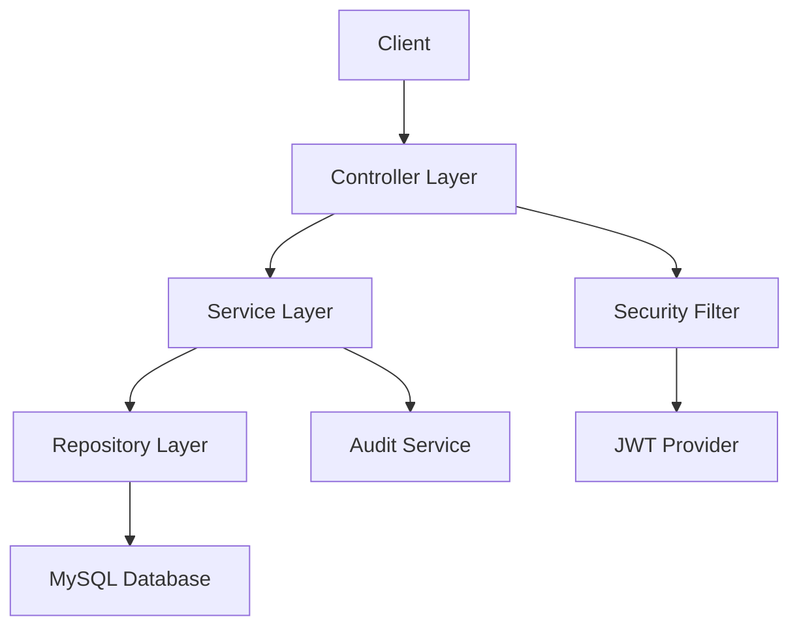
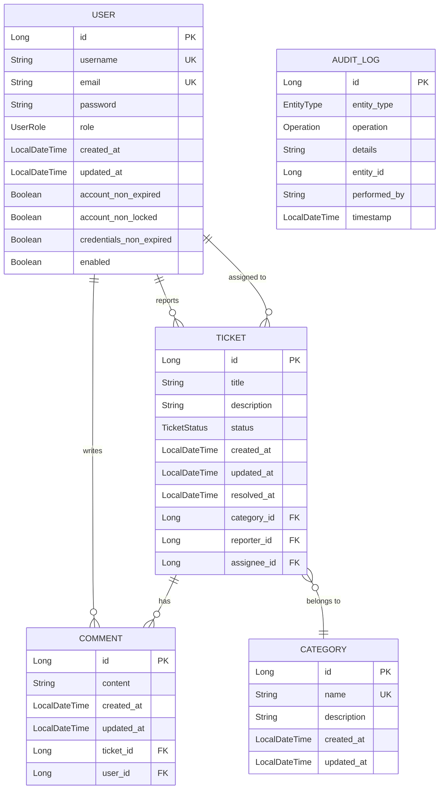

# IT Ticket System


A comprehensive Enterprise IT Ticket Management System built with Spring Boot 3.5.14 and Java 21. The system enables employees to submit IT support tickets, technicians to resolve issues efficiently, and administrators to manage users and system configuration. Features include role-based access control, JWT authentication, full audit trail, and RESTful API design.

## License

This project is licensed under the MIT License - see the [LICENSE](LICENSE) file for details.

## Tech Stack

- **Java 21** - Programming language
- **Spring Boot 3.5.14** - Application framework
- **Spring Data JPA** - ORM and database access
- **Spring Security** - Security framework
- **MySQL 8.0** - Relational database
- **JWT (jjwt 0.12.3)** - Token-based authentication
- **Lombok** - Reduce boilerplate code
- **SpringDoc OpenAPI 2.7.0** - API documentation
- **Docker** - Containerization for database
- **Maven** - Build tool

## Features

- **Role-Based Access Control** - EMPLOYEE, TECHNICIAN, ADMIN roles with method-level security
- **JWT Authentication** - Secure token-based authentication with login/register endpoints
- **Ticket Lifecycle Management** - Complete ticket workflow: NEW, ASSIGNED, IN_PROGRESS, RESOLVED, CLOSED
- **Full Audit Trail** - Track all system changes with comprehensive logging (Admin only)
- **Comment System** - Collaborative ticket discussions with CRUD operations
- **Category Management** - Organize tickets by categories with Admin-only management
- **User Management** - Admin can manage users with full CRUD operations
- **RESTful API Design** - Clean API endpoints following REST principles
- **Input Validation** - Comprehensive request validation using Jakarta Validation
- **Global Exception Handling** - Centralized error handling with custom exceptions
- **API Documentation** - Swagger UI integration via SpringDoc OpenAPI
- **Ticket Sorting** - Sort tickets by various fields (id, title, status, dates)
- **Password Management** - Secure password update functionality for all users

## Architecture


## Database Schema


    
## Prerequisites

- **Java 21** or higher
- **Maven 3.8+** - Build tool
- **Docker** and **Docker Compose** - For MySQL database container
- **MySQL 8.0** - Database
- IDE(IntelliJ IDEA, Eclipse, VS Code, etc.)
- **Git** (optional) - For cloning the repository

## Installation & Setup

### 1. Clone the Repository

```bash
git clone <your-repo-url>
cd it-ticket-system
```

### 2. Open the Folder in IDE

Open the project folder in your preferred IDE (IntelliJ IDEA, Eclipse, VS Code, etc.):

IntelliJ IDEA: File → Open → Select the it-ticket-system folder
Eclipse: File → Import → Existing Maven Projects
VS Code: File → Open Folder → Select the it-ticket-system folder

### 3. Start MySQL Database

Use Docker Compose to start the MySQL container in detached mode (background):

```bash
docker-compose up -d
```

### 4. Create Environment File

Copy the example environment file and configure it:

For Windows:

```bash
copy .env.example .env
```

For Linux/Mac:

```bash
cp .env.example .env
```

Then edit .env and update the JWT_SECRET with a strong key (generate using: openssl rand -base64 64).

### 5. Create Admin User in MySQL

Connect to MySQL database:

```bash
docker exec -it it-ticket-db mysql -u ticket_user -pticket_pass it_ticket_system
```

```sql
INSERT INTO users (username, email, password, role, account_non_expired, account_non_locked, credentials_non_expired, enabled, created_at, updated_at)
VALUES ('admin', 'admin@example.com', '$2a$10$YourBCryptHashedPasswordHere', 'ADMIN', true, true, true, true, NOW(), NOW());
```

Note: To generate a BCrypt hash for your password, you can use an online BCrypt generator or create a temporary Java utility class. For example, a BCrypt hash for password "admin123" would look like: $2a$10$N9qo8uLOickgx2ZMRZoMy...

### 6. Run the Application

Start the Spring Boot application using the Maven wrapper:

On Windows:

```bash
.\mvnw spring-boot:run
```

Or on Linux/Mac:

```bash
./mvnw spring-boot:run
```

### 7. Stop MySQL Database (Optional)

When you're done, stop the MySQL container:

```bash
docker-compose stop
```

## API Documentation

The application uses **SpringDoc OpenAPI** to generate interactive API documentation via Swagger UI.

### Access Swagger UI

Once the application is running, access the Swagger UI at:
http://localhost:8080/swagger-ui.html


### OpenAPI Specification

The raw OpenAPI JSON specification is available at:
http://localhost:8080/v3/api-docs


### Using Swagger UI

- **Browse endpoints** - View all available API endpoints organized by controller
- **Try it out** - Execute API requests directly from the browser
- **View schemas** - Inspect request/response models for each endpoint
- **Authentication** - Use the `/api/auth/login` endpoint to get a JWT token, then click "Authorize" button to enter your token (format: `Bearer <your-jwt-token>`)

### Available Endpoints

The API includes the following main endpoint groups:

- **Authentication** - `/api/auth/*` (login, register)
- **Users** - `/api/users/*` (user management)
- **Tickets** - `/api/tickets/*` (ticket CRUD operations)
- **Comments** - `/api/comments/*` (comment management)
- **Categories** - `/api/categories/*` (category management)
- **Audit Logs** - `/api/audit-logs/*` (audit trail - Admin only)

## Testing

The project includes unit and integration tests to ensure code quality and functionality.

### Run All Tests

Execute all tests using the Maven wrapper:

On windows:

```bash
.\mvnw test
```

On Linux/Mac:

```bash
./mvnw test
```

## Future Improvements

Planned features and enhancements for future releases:

### AI Integration
- **Spring AI Integration** - Automatic ticket categorization using AI/ML

### Enhanced Features
- **Email Notifications** - Email alerts for ticket status changes and assignments
- **File Attachments** - Allow users to attach screenshots and documents to tickets

### Security & Performance
- **Refresh Token Implementation** - Add refresh token support for improved security and user experience, allowing seamless token renewal without frequent re-authentication
- **Rate Limiting** - API rate limiting to prevent abuse
- **Caching Layer** - Redis caching for improved performance
- **Database Optimization** - Query optimization and indexing improvements
